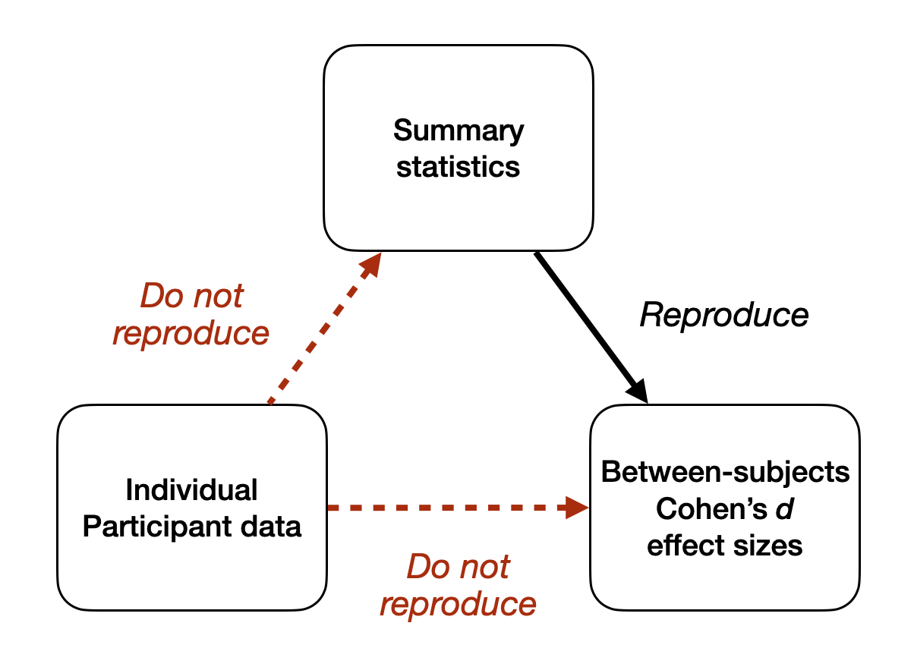

```{r setup, include=FALSE}

knitr::opts_chunk$set(message = FALSE, 
                      warning = FALSE)

```

# Summary 

The abstract reports the result for the secondary outcome variable (MADRS) but not the primary outcome variable (HAM-D). The primary and secondary variables are defined clearly in both the article body and the trial registration.

Several of the key results reported in the abstract and results cannot be computationally reproduced from the manuscript's data. These are summarized in the figure below.

```{r echo=FALSE, out.width='70%'}

```

The pattern of non-reproducible results necessarily implies that one of the following is the case. Either:

(a) the individual participant data reported in the supplementary materials contains errors, or 
(b) the individual participant data reported in the supplementary materials are correct, and the reported results therefore contain errors that substantively affect the article's conclusions, or 
(c) both the data and the results contain errors.

# Data sources

- Individual participant data was reported in supplementary materials figure S1. We extracted those numbers into data.xlsx, which is loaded here.
- Summary statistics for each condition, measure and time-point were reported in both Table 1 and the supplementary materials Tables S3 and S4. They agree between those two sources. We extracted those numbers into data.xlsx, which is loaded here.
- Mean scores for each condition, measure and time-point were also reported in Figures 2 and 3. We extracted those numbers into hamd_from_plot.csv and madrs_from_plot.csv, using WebPlotDigitizer, which are loaded here.
- Between-subjects Cohen's d effect sizes and their 95% Confidence Intervals were reported in the article's abstract (p 1) and results (p 4) and supplementary materials Tables S3 and S4. They agree between those three sources. We extracted those numbers into data.xlsx, which is loaded here.

```{r}

# dependencies
library(tidyverse)
library(readxl)
library(effsize)
library(janitor)
library(knitr)
library(kableExtra)

# extracted from the supplementary materials figure S1
data_scores <- read_excel("../data/data.xlsx", sheet = "data") 

# extracted from table 1 in the article and the supplementary materials Tables S3 + S4
data_summary_stats_reported <- read_excel("../data/data.xlsx", sheet = "summary_stats") 

# extracted from article's abstract (page 1) and results (page 4), supplementary materials Tables S3 + S4
data_between_cohens_ds <- read_excel("../data/data.xlsx", sheet = "between_cohens_ds") 

# # not yet used
# # extracted from article's abstract (page 1) and results (page 4), supplementary materials Tables S3 + S4
# data_within_cohens_ds <- read_excel("../data/data.xlsx", sheet = "within_cohens_ds") 

# data from plots, via WebPlotDigitizer
data_summary_stats_from_plot_hamd <- read.csv("../data/hamd_from_plot.csv", header = FALSE) |>
  rename(condition_timepoint = V1, 
         mean_plotted = V2) |>
  separate(condition_timepoint, into = c("condition", "timepoint")) |>
  mutate(mean_plotted = janitor::round_half_up(as.numeric(mean_plotted), digits = 2)) |>
  mutate(timepoint = fct_relevel(timepoint, "baseline", "d1", "d3", "d7")) |>
  arrange(condition, timepoint) |>
  mutate(measure = "HAMD")

data_summary_stats_from_plot_madrs <- read.csv("../data/madrs_from_plot.csv", header = FALSE) |>
  rename(condition_timepoint = V1, 
         mean_plotted = V2) |>
  separate(condition_timepoint, into = c("condition", "timepoint")) |>
  mutate(mean_plotted = janitor::round_half_up(as.numeric(mean_plotted), digits = 2)) |>
  mutate(timepoint = fct_relevel(timepoint, "baseline", "d1", "d3", "d7")) |>
  arrange(condition, timepoint) |>
  mutate(measure = "MADRS")

data_summary_stats_from_plots <- 
  bind_rows(data_summary_stats_from_plot_hamd,
            data_summary_stats_from_plot_madrs)

```

# Recalculate between-groups Cohen's *d*s from the reported summary statistics

```{r}

# cohen's d from summary stats function
tidy_cohens_d_from_summary_stats <- function(n1, n2, m1, m2, sd1, sd2){
  
  m = (n1 + n2) - 2 # pooled SD's denominator
  sdp = sqrt(((n1 - 1) * sd1^2 + (n2 - 1) * sd2^2)/m) # pooled SD
  d = (m1 - m2)/sdp # d
  #v = 1/n1 + 1/n2 + y^2/(2 * (n1 + n2)) # d's variance
  se <- sqrt((n1 + n2) / (n1 * n2) + (d^2) / (2 * (n1 + n2))) # d's se

  res <- data.frame(d_recalc_stats = d, 
                    d_recalc_stats_ci_lower = d - se*1.96,
                    d_recalc_stats_ci_upper = d + se*1.96)
  return(res)
}

# recalculate and compare
data_between_from_summary_stats <- data_summary_stats_reported |>
  pivot_wider(names_from = "condition",
              values_from = c("n_reported", "mean_reported", "sd_reported")) |>
  group_by(measure, timepoint) %>%
  do(tidy_cohens_d_from_summary_stats(n1 = .$n_reported_control, 
                                      n2 = .$n_reported_intervention, 
                                      m1 = .$mean_reported_control, 
                                      m2 = .$mean_reported_intervention, 
                                      sd1 = .$sd_reported_control, 
                                      sd2 = .$sd_reported_intervention))

# combine
combined_reported_from_summary_stats <- 
  full_join(data_between_cohens_ds,
            data_between_from_summary_stats,
            by = c("measure", "timepoint")) |>
  mutate(d_diff = d_rep - d_recalc_stats,
         ci_lower_diff = d_rep_ci_lower - d_recalc_stats_ci_lower,
         ci_upper_diff = d_rep_ci_upper - d_recalc_stats_ci_upper)
  
# table
combined_reported_from_summary_stats |>
  mutate_if(is.numeric, janitor::round_half_up, digits = 2) |>
  kable(align = "c", col.names = c("Measure", "Timepoint", "Cohen's d", "Lower", "Upper", "Cohen's d", "Lower", "Upper", "Cohen's d", "Lower", "Upper")) |>
  kable_classic(full_width = FALSE) |>
  add_header_above(c(" ", " ", " ", "95% CI" = 2, " ", "95% CI" = 2, " ", "95% CI" = 2)) |>
  add_header_above(c(" ", " ", "Reported" = 3, "Recalculated from summary stats" = 3, "Difference" = 3))

```

- Between-groups Cohen's d values reported in the article **can be** reproduced from the summary statistics reported in the supplementary materials.

# Recalculate between-groups Cohen's *d*s from individual participant data

```{r}

# cohen's d from data function
tidy_cohens_d_from_data <- function(data){
  require(effsize)
  fit <- effsize::cohen.d(score ~ condition, data = data)
  res <- data.frame(d_recalc_data = fit$estimate,
                    d_recalc_data_ci_lower = fit$conf.int[1],
                    d_recalc_data_ci_upper = fit$conf.int[2])
  return(res)
}

# recalculate and compare
data_between_from_data <- data_scores |>
  select(condition, HAMD_d7, MADRS_d1, MADRS_d2, MADRS_d7) |>
  pivot_longer(cols = c("HAMD_d7", "MADRS_d1", "MADRS_d2", "MADRS_d7"),
               names_to = c("measure", "timepoint"),
               names_sep = "_",
               values_to = "score") |>
  group_by(measure, timepoint) %>%
  do(tidy_cohens_d_from_data(.))

# combine
combined_reported_from_data <- 
  full_join(data_between_cohens_ds,
            data_between_from_data,
            by = c("measure", "timepoint")) |>
  mutate(d_diff = d_rep - d_recalc_data,
         ci_lower_diff = d_rep_ci_lower - d_recalc_data_ci_lower,
         ci_upper_diff = d_rep_ci_upper - d_recalc_data_ci_upper)

# table
combined_reported_from_data |>
  mutate_if(is.numeric, janitor::round_half_up, digits = 2) |>
  kable(align = "c", col.names = c("Measure", "Timepoint", "Cohen's d", "Lower", "Upper", "Cohen's d", "Lower", "Upper", "Cohen's d", "Lower", "Upper")) |>
  kable_classic(full_width = FALSE) |>
  add_header_above(c(" ", " ", " ", "95% CI" = 2, " ", "95% CI" = 2, " ", "95% CI" = 2)) |>
  add_header_above(c(" ", " ", "Reported" = 3, "Recalculated from data" = 3, "Difference" = 3))

```

- Between-groups Cohen's d values reported in the article **cannot be** reproduced from the individual participant data reported in the supplementary materials.

# Recalculate summary statistics from individual participant data

```{r}

# recalculate 
data_summary_stats_recalculated <- data_scores |>
  pivot_longer(cols = c(starts_with("MADRS"), starts_with("HAMD")),
               names_to = "measure_timepoint",
               values_to = "score") |>
  separate(measure_timepoint, into = c("measure", "timepoint"), sep = "_") |>
  mutate(timepoint = fct_relevel(timepoint, "baseline", "d1", "d3", "d7")) |>
  arrange(measure, timepoint) |>
  group_by(condition, measure, timepoint) |>
  summarize(n_recalc = n(),
            mean_recalc = mean(score, na.rm = TRUE),
            sd_recalc = sd(score, na.rm = TRUE))

# compare
data_summary_stats_combined <- 
  left_join(data_summary_stats_reported,
            data_summary_stats_recalculated,
            by = c("condition", "measure", "timepoint")) |>
  mutate(n_diff = n_reported - n_recalc,
         mean_diff = mean_reported - mean_recalc,
         sd_diff = sd_reported - sd_recalc)

# table
data_summary_stats_combined |>
  mutate_if(is.numeric, janitor::round_half_up, digits = 2) |>
  kable(align = "c", col.names = c("Condition", "Measure", "Timepoint", "N", "M", "SD", "N", "M", "SD", "N", "M", "SD")) |>
  kable_classic(full_width = FALSE) |>
  add_header_above(c(" " = 3, "Reported" = 3, "Recalculated" = 3, "Difference" = 3))

```

- Means and SDs reported in the supplementary materials **cannot be** reproduced from the individual participant data reported in the supplementary materials at any time points except baseline.
- Where they disagree, reported means all differ from their recalculated values in favour of the intervention over the control (i.e., in a way that would increase Cohen's d).
- Where they disagree, reported SDs all differ from their recalculated values in favour of the intervention over the control (i.e., in a way that would increase Cohen's d).

# Extract means from plots

```{r}

# compare
data_summary_stats_combined <- 
  left_join(data_summary_stats_reported |>
              select(-n_reported, -sd_reported),
            data_summary_stats_from_plots,
            by = c("condition", "measure", "timepoint")) |>
  mutate(mean_diff = mean_reported - mean_plotted)

# table
data_summary_stats_combined |>
  mutate_if(is.numeric, janitor::round_half_up, digits = 2) |>
  kable(align = "c", col.names = c("Condition", "Measure", "Timepoint", "M", "M", "M")) |>
  kable_classic(full_width = FALSE) |>
  add_header_above(c(" " = 3, "Reported" = 1, "Plotted" = 1, "Difference" = 1))

```

- Means from the plots (Figure 2 and Figure 3) **broadly match** the means reported in the supplementary materials, within the usual error associated with extracting data from plots.

# Other error checks that could be done

In rough order of priority:

- Consider further the between-groups Cohen's d at baseline - why are they so large? They don't look this large in the plots. I don't think these values are reported in the article, but need to check.
- Attempt to reproduce the between-groups response rates from the individual participant data reported in the supplementary materials
  - Abstract: "Response rates were high for both groups at D1 and D2, and significantly higher in the ayahuasca group at D7 (64% v. 27%; p = 0.04)."
- Attempt to reproduce the between-groups remission rates from the individual participant data reported in the supplementary materials
  - Abstract: "Remission rate showed a trend toward significance at D7 (36% v. 7%, p = 0.054)."
- Attempt to reproduce within-subjects Cohen's d values from the reported means and SDs in supplementary materials
  - Lars' work suggests these do not reproduce, but multiple version of within-subjects Cohen's d exist and would need to be checked
- Attempt to reproduce the adverse events recalculations (table s6)
- Various *p* values associated with each of the above effect sizes


